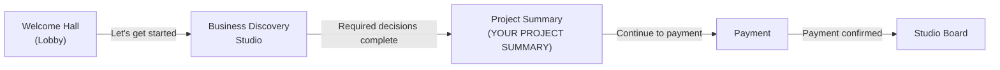

# Business Discovery Studio — Strategic Redesign Proposal

**Status:** Founder-approved direction (Tagia locked decisions, June 2026)  
**Supersedes:** Prior scout proposal (f7a76450) — fixed 7-tile grid, hardcoded V1 pricing, Studio Guide handoff  
**UI pause:** No CSS, animations, plate art, or `BusinessDiscoveryStudioScene` changes until Phase B

---

## Philosophy — Discovery Studio Is The Studio's Brain

Discovery Studio is **not a questionnaire with graphics**. It is the Studio's **brain** — the engine that answers four questions before anything else in the business can run:

1. **What project are we building?**
2. **What services fit?**
3. **What should the customer review?**
4. **What should they pay for?**

Everything after Payment depends on this layer. Once the logic is right, **every project flows through the same engine** — scope is assembled here; pricing is calculated later; the Studio Board receives a structured record.

> **Assembling a project, not filling a form.**  
> Each decision updates an in-memory `DiscoveryProjectSummary`. When required decisions are complete, the drafting table becomes **YOUR PROJECT SUMMARY**.

### Design rules (locked)

| Rule | Detail |
|------|--------|
| Service-connected decisions only | If an answer cannot influence Project Summary, it does not belong |
| Scope, not invoice | Discovery builds **scope**; dollar amounts come from pricing config at **Payment** |
| No package pressure | No Spark / Momentum / Growth recommendation in Discovery |
| Opt-in add-ons | **You May Also Like** — customer chooses; no upsell pressure |
| Decision-driven steps | Count emerges from required decisions — **not** from a 3×3 grid |
| Deterministic mapping | Need → deliverable lookup tables; **no AI guessing** |

---

## 1. Codebase Findings

### Current Discovery Studio

| Area | Location | State |
|------|----------|-------|
| Tile config (8 generic + submit) | `src/config/business-discovery-studio.ts` | Active — 3×3 plate grid |
| Scene + answer state | `src/components/business-discovery-studio/BusinessDiscoveryStudioScene.tsx` | Flat `string` answers per tile |
| Sheet UI | `src/components/business-discovery-studio/DiscoverySheetCard.tsx` | `text`, `textarea`, `select`, `multiselect-other`, `submit` |
| Project Summary | `src/components/business-discovery-studio/ProjectSummaryView.tsx` | Stub — `@deprecated`, returns `null` |
| Entry route | Welcome Hall kiosk → `/business-discovery-studio` via `welcome-hall-phase1.ts` | Primary onboarding path |

**Current 8 generic tiles (to retire):** Your Business, Your Situation, Your Challenge, Your Current Tools, Your Focus, Success Looks Like, What's Slowing You Down, Anything Else, Submit Project.

Tiles like **Your Situation**, **Your Challenge**, **Your Focus**, **Success Looks Like**, and **What's Slowing You Down** have **no deterministic path** to services or Project Summary fields.

Only **Your Current Tools** (`multiselect-other` bubbles) matches the desired interaction pattern.

### Existing catalog sources (reference only)

| Source | Path | Relevance |
|--------|------|-----------|
| Packages (Spark / Momentum / Growth) | `src/config/studio-guide.ts` | **Deprecated for Discovery** — packages not recommended here |
| V1 lock copy + prices | `src/config/studio-guide-v1-lock.ts` | **Payment step only** — not Discovery |
| Deliverable categories | `src/config/deliverables.ts` | Social, Email, SMS, Video, Calendar |
| Draft Room goal / project / audience chips | `src/config/draft-room.ts` | Reusable chip labels and IDs |
| Welcome Hall V3 tower faces | `src/config/welcome-hall-v3-direction.ts` | Aspirational categories — not wired |

**Policy constraint** (`studio-guide-v1-lock.ts` → `studioGuideCustomerClarifications`): The Studio creates **marketing assets** (copy, concepts, calendars). It does **not** run ads, manage social accounts, or build automation. Needs like "Better Business Systems" map to in-scope deliverables or surface honestly in **You May Also Like**.

### New canonical catalog (Phase A)

| File | Purpose |
|------|---------|
| `src/config/studio-services.ts` | Need IDs, deliverable mapping, add-on catalog — **no prices** |

---

## 2. Decisions the Discovery Engine Must Make

**Start here:** *What decisions do we need to make?* — not *how many tiles fit the grid?*

Each decision below maps to a **summary field** and optionally to **service lines** or **add-on suggestions**. Count is **8 decision steps + 1 review gate** in this proposal (~9 plate slots if all are surfaced as tiles). That number is a **consequence** of the decision list, not a design target. Plate art may lag; logic ships first.

### Decision inventory

| # | Decision ID | Question (customer-facing) | Why needed | Summary field(s) | Service / add-on mapping |
|---|-------------|------------------------------|------------|------------------|--------------------------|
| 1 | `customer-identity` | What's the name of your business or project? | Identity for every downstream record | `customerInfo.businessName` | None — metadata |
| 2 | `desired-outcomes` | What should The Studio help you with? | **Core scope driver** — selects needs | `projectGoals.needs`, `projectIncludes[]` | Need → deliverable lookup (`NEED_TO_DELIVERABLES`) |
| 3 | `project-type` | What are we helping you create? | Campaign shape and creative direction | `projectGoals.projectTypes` | Refines Campaign Creation scope |
| 4 | `target-audience` | Who are you trying to reach? | Content angle for social, email, SMS | `customerInfo.audience` | Targeting context on deliverables |
| 5 | `support-appetite` | How much ongoing support sounds right? *(optional)* | Informs **You May Also Like** — not package lock | `youMayAlsoLike[]` pre-checks | Suggest Monthly Support, Customer Follow-Up when relevant |
| 6 | `current-context` | What tools or platforms do you use today? *(optional)* | Gap detection for honest add-on suggestions | `customerInfo.currentTools`, `youMayAlsoLike[]` | No email tool → Email Marketing add-on; no CRM → Business Workflow |
| 7 | `final-notes` | Anything else we should know? *(optional)* | Free context when non-empty | `customerInfo.notes` | None unless notes mention a gap |
| 8 | `review-and-continue` | Review your project and continue. | Gate — renders full summary | All sections | Handoff to Payment |

**Removed (no service mapping):** journey stage, generic challenge, focus, success narrative, blockers-as-primary-intake.

### Decision 2 — outcome bubbles (need selector)

| Bubble label | Need ID | Primary deliverables → `projectIncludes` |
|--------------|---------|-------------------------------------------|
| Get More Customers | `get-more-customers` | Campaign Creation, Email Campaign, SMS Messaging |
| Better Branding | `better-branding` | Campaign Creation, Brand Messaging, Marketing Graphics |
| Create Content | `create-content` | Social Media Content, Video Scripts |
| Improve Communication | `improve-communication` | Email Campaign, SMS Messaging |
| Better Business Systems | `better-business-systems` | Marketing Calendar, Campaign Planning |
| Workflow Improvements | `workflow-improvements` | Marketing Calendar *(in-scope asset only)* |
| Better Customer Experience | `better-customer-experience` | Email Campaign, SMS Messaging, Social Media Content |

**Field type:** `multiselect` chips (reuse `multiselect-other` pattern without Other, or dedicated type). **Required:** ≥1 selection.

### Decision 3 — project type chips

Reuse `draft-room.ts` → `intakeForm.sections.project.starterChips`:

Promotion · Event · Product Launch · Service · Brand Awareness · Social Media Campaign · Seasonal Offer · Other

**Required:** ≥1 selection (or single select + optional detail — TBD in open questions).

### Decision 4 — audience chips

Reuse `draft-room.ts` → `intakeForm.sections.audience.options` (chip multiselect).

**Required:** ≥1 selection.

### Decision 5 — support appetite *(optional)*

| Option | Effect on summary |
|--------|-------------------|
| One-time project | No pre-checked add-ons |
| Some ongoing help | Pre-surface **Customer Follow-Up** in You May Also Like |
| Regular monthly support | Pre-surface **Monthly Support** in You May Also Like |

**Does not** recommend Spark / Momentum / Growth. **Does not** set price.

### Decision 6 — current tools *(optional)*

Keep existing **Your Current Tools** bubble list from `business-discovery-studio.ts`. Parsed selections feed gap detection:

| Gap | Suggested add-on in You May Also Like |
|-----|---------------------------------------|
| No email marketing platform | Email Marketing |
| No SMS capability | SMS Campaign |
| No CRM / project management | Business Workflow |
| Starting from scratch | (no penalty — optional Campaign Planning in includes if needs warrant) |

### Deterministic includes example

**Selections:** Get More Customers + Better Branding + Create Content

**`projectIncludes[]` (ordered, deduped):**

1. Campaign Creation
2. Brand Messaging
3. Marketing Graphics
4. Social Media Content
5. Email Campaign *(from Get More Customers)*
6. Video Scripts *(from Create Content)*

Not AI-generated — pure lookup from `NEED_TO_DELIVERABLES`.

### You May Also Like — opt-in add-ons (never pre-included)

| Add-on ID | Label | When suggested |
|-----------|-------|----------------|
| `email-marketing` | Email Marketing | Communication needs, tool gap, or customer opts in |
| `sms-campaign` | SMS Campaign | Get More Customers / Improve Communication, or tool gap |
| `business-workflow` | Business Workflow | Systems / workflow needs, or CRM gap |
| `customer-follow-up` | Customer Follow-Up | Support appetite = "some ongoing help" |
| `monthly-support` | Monthly Support | Support appetite = "regular monthly support" |

Customer checks boxes to opt in. Unchecked items stay **out of** `projectIncludes` and **out of** `estimatedInvestment.servicesForPricing` until selected.

---

## 3. Customer Journey — Locked Flow

**No Draft Room. No old Studio Guide. No extra stop.**



| Step | Route (current / planned) | Responsibility |
|------|-------------------------|----------------|
| Lobby | `/` Welcome Hall kiosk | Wonder, impress, single CTA into Discovery |
| Discovery Studio | `/business-discovery-studio` | Brain — assemble scope via decisions |
| Project Summary | Same route — summary mode on drafting table | Review **Your Project Includes**, opt into **You May Also Like**, see **Estimated Investment** copy |
| Payment | TBD — pricing config reads `servicesForPricing` | Calculate totals from pricing configuration |
| Studio Board | `/studio-board` | Campaign record with discovery snapshot |

**Deprecated paths (do not hand off here):**

- `/draft-room` — Draft Room intake
- `/studio-guide`, `/studio-guide-prototype` — package-based Studio Guide

---

## 4. Project Summary — What the Customer Sees

When required decisions are complete, the drafting table transforms to **YOUR PROJECT SUMMARY**:

### Section layout

| Section | Content | Source |
|---------|---------|--------|
| **Your Project Summary** | Business name, project types, audience, notes | Decisions 1, 3, 4, 7 |
| **Recommended Services** / **Your Project Includes** | ✔ Campaign Creation, Social Media Content, Marketing Graphics, … | `projectIncludes[]` from need → deliverable mapping + opted-in add-ons |
| **You May Also Like** | ☐ Email Marketing, SMS Campaign, Business Workflow, Customer Follow-Up, Monthly Support | `youMayAlsoLike[]` — unchecked by default |
| **Estimated Investment** | Copy only: **"Based on your selected services"** | No dollar amounts in Discovery layer |

Primary CTA: **Continue to Payment** (not Studio Guide).

---

## 5. Data Model — `DiscoveryProjectSummary`

**Proposed files:**

- `src/config/studio-services.ts` — catalog + mappings (Phase A scaffold)
- `src/lib/discovery-summary.ts` — types, parsers, `buildSummaryFromAnswers` (Phase A)

```typescript
/** Deliverable included because customer needs warrant it or they opted in */
export type ServiceLine = {
  id: StudioDeliverableId;
  label: string;
  sourceNeeds: StudioNeedId[];
  /** true when customer checked an add-on that promoted this line */
  fromAddOn?: boolean;
};

/** Optional add-on — never included until customer opts in */
export type AddOnOption = {
  id: AddOnId;
  label: string;
  reason?: string;
  suggested: boolean;
  selected: boolean;
};

export type DiscoveryProjectSummary = {
  customerInfo: {
    businessName: string;
    audience: string[];
    currentTools: string[];
    notes?: string;
  };

  projectGoals: {
    needs: StudioNeedId[];
    needLabels: string[];
    projectTypes: string[];
  };

  /** ✔ Your Project Includes — from selections + opted-in add-ons */
  projectIncludes: ServiceLine[];

  /** ☐ You May Also Like — opt-in checkboxes, not included by default */
  youMayAlsoLike: AddOnOption[];

  /** Scope handoff to Payment — NO dollar amounts here */
  estimatedInvestment: {
    label: "Based on your selected services";
    servicesForPricing: string[];
  };

  /** Deferred — Payment step reads pricing config and fills snapshot */
  pricingSnapshot?: null;

  completeness: {
    requiredComplete: boolean;
    missingDecisions: string[];
  };
};
```

### Removed from prior proposal

| Field | Reason |
|-------|--------|
| `recommendedPackage` | Package model deprecated in Discovery |
| `estimatedTotal.amount` | Prices live in pricing config, applied at Payment |
| `suggestedStartingPoint` | Renamed/replaced by `projectIncludes` (same mapping, clearer UX label) |
| `additionalServicesAvailable` | Renamed to `youMayAlsoLike` with explicit opt-in semantics |

### Pure functions

```typescript
/** Deterministic — no AI */
export function buildSummaryFromAnswers(
  answers: Partial<DiscoveryAnswers>,
): DiscoveryProjectSummary;

export function parseDiscoveryAnswers(
  raw: Partial<Record<DiscoveryDecisionId, string>>,
): Partial<DiscoveryAnswers>;

/** Union deliverables from needs; merge opted-in add-ons */
export function resolveProjectIncludes(
  needs: StudioNeedId[],
  selectedAddOns: AddOnId[],
): ServiceLine[];

/** Suggest add-ons from needs, support appetite, tool gaps — none selected by default */
export function suggestYouMayAlsoLike(
  answers: Partial<DiscoveryAnswers>,
): AddOnOption[];

/** IDs for Payment pricing config — includes + selected add-ons only */
export function servicesForPricing(summary: DiscoveryProjectSummary): string[];
```

### Pricing boundary (locked)

```
Discovery layer          Payment layer
─────────────────        ─────────────────────────────
projectIncludes      →   pricing config lookup keys
selected add-ons     →   line-item calculation
estimatedInvestment  →   actual totals, tax, billing cadence
.label only              pricingSnapshot populated here
pricingSnapshot: null
```

If prices change, update **pricing configuration only** — Discovery logic and `NEED_TO_DELIVERABLES` stay stable.

---

## 6. Migration Plan

### Phase A — Config & types only *(current — no UI/CSS)*

| File | Change |
|------|--------|
| `src/config/studio-services.ts` | **New** — need IDs, deliverable mapping, add-on catalog |
| `src/lib/discovery-summary.ts` | **New** — types, parsers, `buildSummaryFromAnswers` |
| `src/config/business-discovery-studio.ts` | **Later** — replace tile IDs/questions when decisions finalized |
| Unit tests (optional) | Mapping tables — directive example asserts exact `projectIncludes` |

### Phase B — Wire live summary (minimal UI)

| File | Change |
|------|--------|
| `BusinessDiscoveryStudioScene.tsx` | `useMemo(() => buildSummaryFromAnswers(...))` on every save |
| `DiscoverySheetCard.tsx` | `multiselect` chip type if needed |
| `ProjectSummaryView.tsx` | Implement summary sections per §4 |

### Phase C — Summary transformation + handoff

| Work | Detail |
|------|--------|
| Drafting table → YOUR PROJECT SUMMARY | Summary mode when required decisions complete |
| You May Also Like | Checkbox interactions update `projectIncludes` + `servicesForPricing` live |
| CTA | **Continue to Payment** — pass `servicesForPricing` |
| Persist | sessionStorage or intake API (pattern from `src/lib/draft-intake.ts`) |

### Phase D — Plate art *(later, not blocking logic)*

Baked tile titles on `discovery-studio-plate-v1.png` still show retired labels. Options:

- HTML overlay labels short-term
- Commission `discovery-studio-plate-v2.png` when decision count/layout stabilizes
- Recalibrate `tileHits` / `tileDoneBadges` if slot count changes

**Do not force experience to fit 3×3** — if decisions require 8 slots + summary, plate art follows logic.

### Phase E — Downstream integration

| Target | Integration |
|--------|-------------|
| Payment | Read `servicesForPricing[]` from pricing config; write `pricingSnapshot` on campaign |
| Studio Board | `DRAFT_RECEIVED` / `PAYMENT_RECEIVED` record includes discovery summary |
| Draft Room / Studio Guide | **No handoff** — routes deprecated for new customer flow |

### What NOT to do

- Pop-out animations, badge tweaks, new CSS (until Phase B approved)
- Hardcoded prices in Discovery
- AI/LLM for service or add-on suggestions
- Package recommendation (Spark / Momentum / Growth)
- Generic business questions that don't affect summary

---

## 7. Decision → Summary Mapping (quick reference)

| Decision | Affects | Studio connection |
|----------|---------|-------------------|
| Customer identity | `customerInfo.businessName` | Project record identity |
| Desired outcomes | `projectGoals`, `projectIncludes` | **Core service selector** |
| Project type | `projectGoals.projectTypes` | Campaign shape |
| Target audience | `customerInfo.audience` | Content targeting |
| Support appetite | `youMayAlsoLike` suggestions | Opt-in only — no package |
| Current context | `customerInfo.currentTools`, `youMayAlsoLike` | Gap detection |
| Final notes | `customerInfo.notes` | Context when non-empty |
| Review and continue | Full summary render | Gate → Payment |

---

## 8. Open Questions for Tagia

Minimal — locked decisions resolved most prior scout questions.

1. **Payment route** — New `/payment` page, or extend an existing sandbox (`src/lib/payment-sandbox.ts`)? What pricing config file becomes source of truth?
2. **Project type + audience** — Multiselect (≥1) or single-select with optional detail field, matching Draft Room patterns?
3. **Plate slot count** — Ship Phase B with overlay labels on v1 plate (9 slots), or wait for v2 art if decision count changes?

---

## Deliverable Status

| Item | Status |
|------|--------|
| Founder locked decisions incorporated | ✅ |
| Decision-driven framework (§2) | ✅ |
| Updated `DiscoveryProjectSummary` model (§5) | ✅ |
| Journey flow diagram (§3) | ✅ |
| `src/config/studio-services.ts` scaffold | ✅ Phase A |
| UI / plate / CSS changes | ⏸ Paused |
| `src/lib/discovery-summary.ts` implementation | 🔜 Phase A follow-up |
