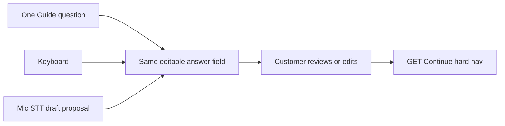

# Lobby Guide — Voice Architecture V1

| Field | Value |
|---|---|
| Room | Studio Lobby |
| Status | **APPROVED — design authority for Lobby voice layer** |
| Owner | Tagia |
| Date | 2026-07-17 (Approved) |
| Product lock | `docs/lobby-guide-conversation-v1-locked.md` |
| Config (text skeleton) | `src/config/studio-guide-conversation-v1.ts` |
| Next artifact | `docs/lobby-guide-voice-package-1-implementation-plan-v1.md` |

**Approval status**

| Gate | Status |
|------|--------|
| Architecture direction | Approved with revisions (Tagia 2026-07-17) |
| This document | **APPROVED** (Tagia 2026-07-17) — design authority |
| Voice Package 1 Implementation Plan | Next — separate review before any code |
| Voice implementation | **Not approved yet** |

**The microphone is an alternate input method, not an alternate conversation.**

Typing, speaking, paste, and future inputs (for example camera OCR) all feed the **same** Guide conversation and the **same** answer field. They are not separate experiences, modes, or workflows.

**Engineering workflow (Lobby layers)**

> Lock vision → Design architecture → **Approve architecture** → Inspect implementation package → **Approve implementation package** → Build certifiable slice → Desktop → Samsung → Fix → **Re-certify** → Lock layer → Next layer

The two approval gates and **Re-certify** are mandatory. Fixing a bug is not the finish line — prove the fix did not introduce a new one before locking the layer.

**Two-step gate (mandatory)**

1. **Architecture approval** approves the **design** only (this sheet).  
2. **Implementation package approval** (**Voice Package 1 Implementation Plan**: files in/out/not touched, tests, rollback, certification, acceptance criteria) must be reviewed and approved **separately**.  

Only after Tagia approves the written architecture **AND** the implementation package is reviewed may Scout begin the first voice implementation slice. Document approval alone never authorizes coding.

### Layer Completion Doctrine

A room is complete only when the approved customer experience for that room is **implemented, certified on supported devices, committed, pushed, and explicitly locked by the owner**.

- Passing a technical slice does **not** complete a room.  
- Passing an architecture review does **not** complete a room.  
- Passing desktop does **not** complete a room.  
- Passing mobile does **not** complete a room.  

**Only the entire approved experience closes the room.**

**Certification context**

- **Mobile launch and navigation stability: PASS** (owner-confirmed on Samsung — type path, Continue, Confirm). That is a **slice**, not Lobby completion.  
- Lobby remains open until the finished conversation (type or speak, same field, summary, confirm) meets Layer Completion Doctrine.

---

## Product intent (Crayon Mode)

The customer should be able to say:

> “I’m starting a new business.”

instead of typing it.

The Guide hears it, writes it into the **same** answer field, lets the customer verify it, then moves to the next question via the existing Continue path.

- Same conversation  
- Same screen  
- No “Voice Mode”  
- No separate workflow  
- Typing remains a **first-class** path, not an emergency exit  

---

## Transcript Confidence Doctrine

**Speech is a drafting tool, not truth.**

- The microphone **proposes**.  
- The customer **approves** (by reviewing, editing, and continuing).  
- The Studio **never assumes** recognition is correct.  

This applies to every speech engine now and in the future. A final transcript entering the field is a draft proposal until the customer continues with it. Silent acceptance, auto-advance, or treating provider output as ground truth is forbidden.

---

## Interruption Doctrine

**The customer is always in control.**

**Human action always wins over automation.**

| Human action | Required behavior |
|--------------|-------------------|
| Customer begins typing | Voice recognition **stops** immediately; typed characters are kept |
| Customer edits the answer field | Voice **never overwrites** customer edits; a later final transcript must not clobber text the customer has changed since listening started (if the field was edited mid/post listen, do not replace — customer text wins) |
| Customer presses Continue or Skip | Recognition **stops** before/as navigation proceeds |
| Customer changes page, closes panel, or leaves the step | Recognition **stops**; TTS cancels; no background listen |
| Customer taps mic while listening | Recognition **stops** (toggle off) |
| Customer starts mic while TTS is speaking | TTS **cancels** first; then listening may start |

Automation never traps the customer in listening, speaking, or processing.

---

## Product Guide voice vs browser TTS

Browser `speechSynthesis` is a **temporary implementation** for spoken output in V1.

**The Guide’s personality, pacing, wording, and emotional tone are product assets.** They must remain independent of the underlying speech engine.

- Product copy and spoken summary **wording** live in Studio config / product locks.  
- The TTS engine only **renders** that wording.  
- Swapping engines (browser TTS → another voice pipeline) must not redefine who the Guide is or rewrite her lines as an engine side effect.

---

## Locked V1 decisions

| Decision | Locked V1 direction |
|----------|---------------------|
| STT | Browser `SpeechRecognition` / `webkitSpeechRecognition`, feature-detected (`window.SpeechRecognition \|\| window.webkitSpeechRecognition`) |
| STT framing | **Browser-managed speech recognition** with limited browser availability and **provider-dependent processing** — V1 experiment only |
| Processing | **Browser/provider controlled; audio may leave the device for recognition** |
| Studio backend | **No Studio-operated audio upload, storage, or transcription backend in V1** |
| TTS | Browser `speechSynthesis` (temporary implementation; OS/browser voices vary) |
| Product Guide voice | Personality, pacing, wording, tone — product assets, engine-independent |
| Unsupported browser | Hide or disable mic with plain explanation; typing remains fully functional |
| Permission denied | Explain how to enable access; preserve typed answer and Continue |
| Transcript handling | Interim text may display; **only final transcript** enters the editable answer field as a **draft proposal** |
| Advancement | **Never** auto-advance after speech |
| Confirmation | Customer reviews or edits before Continue |
| HTTPS test | Trusted local HTTPS first; secure tunnel fallback |
| Privacy copy | Tell the customer browser speech services may process audio |
| Storage | **Do not store raw audio** |
| Session behavior | Stop recognition when panel closes, question changes, page hides, or mic is tapped again |
| TTS behavior | Never speak over active listening; cancel speech before starting recognition |
| Accessibility | Full keyboard and text workflow remains available |
| Interruption | Human action always wins over automation |
| Confidence | Speech is a drafting tool, not truth |

### Critical distinction (do not conflate)

| Accurate | Inaccurate |
|----------|------------|
| **No Studio backend** processes audio in V1. The Studio does not upload, store, or transcribe audio on its own servers. | “Audio does not go elsewhere.” |
| Chrome-style `SpeechRecognition` implementations **may send audio to a browser-provider web service** for recognition. It is not necessarily local, private, or offline. (See MDN Web Speech API notes on server-based recognition.) | Claiming V1 speech is on-device-only or Studio-private. |

---

## STT (V1 experiment)

**API:** `window.SpeechRecognition || window.webkitSpeechRecognition`

**Approved as:** a V1 experiment — not a long-term guarantee of cross-browser parity.

**Document in product/engineering terms as:**

> Browser-managed speech recognition with limited browser availability and provider-dependent processing.

**Implications**

- Feature-detect before showing a usable mic control.  
- Typing must remain first-class on every supported surface.  
- Do not build a Studio transcription service in this package.  
- Future engines swap behind a thin client adapter (see Replacement strategy) without changing conversation state or Continue hard-nav.

---

## TTS (V1 implementation)

**API:** `window.speechSynthesis` — temporary spoken-output implementation only.

**Approved for V1 rendering.** Uses voices available through the OS/browser; expect variation across desktop and Samsung.

**Rules**

- Speak product-authored summary wording on the summary step (spoken shape from the product lock).  
- Cancel TTS before starting recognition.  
- Never speak over active listening.  
- Stop TTS when leaving summary, closing the panel, or when recognition starts.  
- Do not let engine voice quality or available system voices redefine Guide personality.

---

## Studio vs browser processing

```
Customer mic
    → Browser SpeechRecognition (provider may process audio off-device)
    → Final transcript string proposed into the Guide answer field
    → Customer review / edit
    → Existing GET Continue / draft carry (text only)

Studio servers in V1:
    → Do NOT receive raw audio
    → Do NOT store raw audio
    → Do NOT run transcription
    → Do NOT run AI understanding on speech (out of scope for V1 capture path)
```

Persistence remains **text draft only** (existing Guide capture draft + hard-nav carry params).

---

## Hearing vs understanding (layer separation)

Speech recognition and AI understanding are **different jobs**. They must never be merged conceptually.

**V1 (this package) — hearing words:**

```
Speech
  → Transcript
  → Customer review
  → Confirmed by Continue (customer-approved text in field)
  → Next question (deterministic Guide capture)
```

**Future (not V1 implementation) — understanding meaning:**

```
Speech
  → Transcript
  → Customer review
  → Confirmed transcript
  → AI understanding
  → Structured capture
  → Customer confirmation
  → Next question
```

| Layer | Job |
|-------|-----|
| Speech recognition (STT) | Hears words → text |
| Customer review | Approves or corrects the draft |
| AI understanding (future) | Interprets meaning → structured fields — **separate** from STT |
| Customer confirmation of structure (future) | Approves what the Studio understood |

V1 must not hide “understanding” inside the speech adapter. Deterministic Guide questions remain the capture path until a future package explicitly designs and approves an understanding layer.

---

## Samsung / secure-context testing

Microphone and speech recognition generally require a **secure context**.

| Context | Typical mic access |
|---------|-------------------|
| `https://…` | Allowed after permission |
| `http://localhost` / `http://127.0.0.1` | Allowed (desktop special case) |
| Ordinary `http://10.x` / `http://192.168.x.x` | Often **blocked** |

### Test order (locked)

1. **Trusted local HTTPS first** — certificate that the Samsung device actually trusts for the LAN hostname or IP (not merely “HTTPS exists”).  
   - `next dev --experimental-https` is a valid **development** starting point and generates a local/self-signed cert.  
   - Next’s docs emphasize HTTPS on **localhost**; **LAN trust must be verified on the real Samsung**, not assumed.  
2. **If Samsung does not trust the cert cleanly** → use a **secure tunnel** (e.g. HTTPS tunnel to the dev server).  
3. **Do not** spend half a day wrestling certificates while voice work is blocked — switch to the tunnel fallback promptly.

Text-path Samsung PASS on plain HTTP remains valid. **Voice PASS requires a secure context the device accepts.**

---

## Permission flow

1. Customer taps the mic (explicit gesture).  
2. Enter `requesting_permission` if the browser must prompt.  
3. If granted → `listening`.  
4. If denied → `error` with how to enable access; keep any typed text; Continue still works.  
5. Never start listening automatically on open or on each new question.

---

## Fallback matrix

| Situation | Behavior |
|-----------|----------|
| Unsupported API | State `unsupported`; hide or disable mic; plain explanation; typing fully functional |
| Permission denied | Explain enable path; preserve answer field + Continue |
| Secure context missing | Explain voice needs the HTTPS (or tunnel) Lobby URL; typing works |
| Recognition error / timeout / no speech | Stop listening; keep field contents; allow retry or type |
| Provider / network failure | Same as error; never clear prior draft answers |

---

## Shared conversation state (type + speak)

- **One** answer field (`ganswer` / `#studio-guide-answer`).  
- **One** draft and Continue path (existing Samsung-safe GET hard-nav + carry fields).  
- Mic only **proposes** text into that field; it does not create a parallel store.  
- Interim results may show in a non-committing display; **only final** transcript is written into the editable field as a draft.  
- Customer always reviews/edits, then taps Continue (or Skip). **Never auto-advance** on speech end.  
- Summary Confirm / Correct remain the same touch GET forms; voice confirm (later implementation) may only **trigger** those forms after an explicit matched intent — still never silent assume.



---

## Privacy copy (required)

Customer-facing instructional copy must state, in a complete sentence, that **browser speech services may process audio** when they use the microphone.

Do not imply The Studio stores or privately transcribes the recording in V1.

---

## Storage

- **Do not store raw audio** (no blobs, no uploads, no local audio files for Guide V1).  
- Persist **transcript text** only through the existing Guide draft mechanisms (after customer Continue).

---

## Voice state machine (required before code)

### States

| State | Meaning |
|-------|---------|
| `idle` | Mic available (if supported); not listening; field may hold typed or prior final text |
| `requesting_permission` | Waiting on browser/system mic permission |
| `listening` | Recognition active; interim display may update |
| `processing` | Recognition stopping / finalizing; waiting for final result |
| `transcript_ready` | Final transcript written into the editable field as a draft; customer may edit; still must Continue manually |
| `error` | Recoverable failure (permission, timeout, no-speech, network); message shown; typing remains |
| `unsupported` | API or secure-context gate failed; mic hidden/disabled |

### Listening UX (customer-visible — locked per state)

Developers must not invent alternate listening UI. Complete sentences for instructional copy.

| State | Customer sees |
|-------|----------------|
| `idle` | Mic button available (enabled). Answer field editable. No listening animation. |
| `requesting_permission` | Mic control in a waiting state. Plain message: “Waiting for microphone permission.” |
| `listening` | Mic control glows or pulses. Plain message: “Listening.” Interim text may appear in a non-committing preview only. |
| `processing` | Small spinner or equivalent busy indicator. Plain message: “Finishing.” |
| `transcript_ready` | Final transcript appears in the editable answer field. Mic returns toward available. Customer may edit. Continue remains a separate action. Optional short note that they can review before continuing. |
| `error` | Friendly, complete-sentence message plus a Retry affordance (and typing still works). Mic available to retry when appropriate. |
| `unsupported` | Mic hidden or disabled with a plain explanation. Typing and Continue fully functional. |

### Transitions (normative)

```
unsupported  → (terminal for mic; typing only)
idle → requesting_permission → listening → processing → transcript_ready → idle
idle → listening                         (if permission already granted)
* → error → idle                         (after dismiss/retry affordance)
* → idle                                 (stop: mic tap, close, step change, page hide, Continue, typing)
```

Implementation must treat these as an explicit machine (single current state), not ad-hoc flags that can disagree.

### Event table

| Event | Required behavior |
|-------|-------------------|
| User taps mic while `idle` | Start permission/listen path |
| User taps mic while `listening` or `processing` | **Stop** recognition; return toward `idle`; keep any committed final text already in the field; clear interim-only display |
| User taps mic while `requesting_permission` | Cancel if possible; return to `idle` |
| User taps mic while `transcript_ready` or `error` | Start a new listen (**replace** field with new final transcript on next final **only if** the customer has not edited the field since the prior proposal; if they edited, do not overwrite — Interruption Doctrine) |
| Customer types while `listening` | **Stop** recognition immediately; keep the typed characters; go to `idle` (typing wins) |
| Customer edits while a draft is in the field | Voice never overwrites those edits |
| Customer presses Continue or Skip | Stop recognition; cancel TTS; allow navigation |
| TTS is already speaking | **Cancel TTS** before entering `listening`; never overlap TTS and listening |
| No speech detected | → `error` (or brief message then `idle`) with complete-sentence copy; field unchanged |
| Recognition times out | Stop; → `error` or `idle` with message; field unchanged unless a final result already arrived |
| Browser returns multiple results | Prefer the **final** result chosen by the API (`isFinal`); if multiple finals, use the **last final** for the field; do not concatenate unbounded partials into the committed field |
| Panel closes during listening | Stop recognition; cancel TTS; reset machine to `idle`/`unsupported` as appropriate; no background listen |
| Customer changes questions (step change / hard-nav) | Stop recognition; cancel TTS; clear interim UI; new step starts at `idle` (or `unsupported`) |
| Phone screen locks / tab `visibilitychange` hidden / page hide | Stop recognition; cancel TTS; return to `idle` (or keep `error` message if useful once visible again) |

---

## Adapter boundary (future replacement)

Logical port (name illustrative):

- `isGuideSpeechSupported(): { recognition, synthesis, secureContext }`  
- `startGuideDictation` / `stopGuideDictation`  
- `speakGuideText` / `stopGuideSpeech`  
- `buildGuideSpokenSummary(draft)` — builds from **product** wording assets  
- optional later: `matchGuideVoiceConfirmIntent(transcript)`  

V1 implements the port with browser Web Speech only. A later cloud or on-device engine can replace the adapter **without** changing question order, draft schema, hard-nav, “same field” UX, Guide personality assets, or the hearing-vs-understanding separation.

AI understanding (future) is **not** part of this adapter; it is a separate layer above customer-confirmed text.

---

## Browser / mobile expectations

| Surface | Expectation |
|---------|-------------|
| Desktop Chrome (secure context) | Primary engineering verify |
| Samsung Internet / Chrome on Samsung (trusted HTTPS or tunnel) | Owner certify for voice PASS |
| Safari / Firefox | Feature-detect; often weak or absent recognition — typing first-class; not a Samsung-first blocker unless Tagia expands scope |

---

## Explicit non-goals (this package)

- “Select Voice Mode” or dual type-vs-voice flows  
- Studio-operated audio upload, storage, or transcription backend  
- Claiming audio stays on-device or never leaves the browser provider  
- AI understanding / paraphrase / extraction of spoken answers in V1  
- Merging STT and AI understanding into one conceptual layer  
- Auto-advance on transcript  
- Treating speech output as truth without customer review  
- Declaring Lobby complete after this sheet or after first mic prototype  
- Leaving Lobby for Route Map during this package  

---

## Implementation gate

**This architecture is APPROVED** (Tagia 2026-07-17).

**Next blueprint artifact (written; pending separate approval — still no code):**

- **Voice Package 1 Implementation Plan** — `docs/lobby-guide-voice-package-1-implementation-plan-v1.md`

**Not allowed until Tagia also approves the Voice Package 1 Implementation Plan:**

- microphone UI  
- `SpeechRecognition` / `webkitSpeechRecognition` wiring  
- `speechSynthesis` wiring  
- HTTPS / tunnel scripts tied to voice  
- any commit framed as Lobby voice complete or Lobby room complete  

Architecture approval ≠ permission to code.  
Implementation package approval ≠ Lobby complete (see Layer Completion Doctrine).  
Desktop PASS ≠ room complete. Mobile PASS ≠ room complete. Re-certify after every fix before locking a layer.

When both gates pass, implementation must follow this sheet’s state machine, Listening UX, doctrines, and decision table without inventing alternate conversation modes. Stay on Studio Lobby — no Route Map, Board, or new room.
