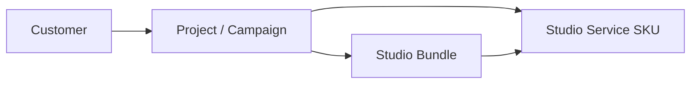
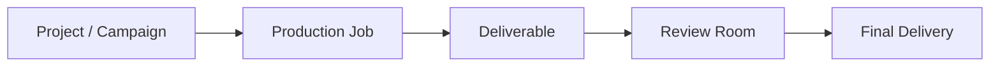

# Studio Service Catalog — Phase 2 (architecture)

**Status:** Implemented and committed (`c629f45`); Phases 3–5 extend wiring and hardening.  
**Scope:** Catalog unification foundation. Consumer wiring completed incrementally in Phases 3A–4.

## Schema

- **`StudioServiceEntry` schema v3** — `CATALOG_SCHEMA_VERSION = 3`
- **V2-ready optional fields** (populated at export via `normalizeStudioServiceEntry` even when seeds omit them):
  - `reviewType` — Review Room sign-off model
  - `deliveryPackage` — Final Delivery package shape
  - `pricingDisplayType` — customer-facing price label strategy
  - `qaChecklist` — production QA template + item IDs
  - `aiPromptRef` — stable AI prompt template key (prompt bodies live outside catalog)

Architecture first. Feature richness second — fields exist in schema; consumer wiring is phased.

## Folder structure

```
src/catalog/
  types.ts              — schema v3 types
  normalize.ts          — v3 default derivation at export
  seeds/
    index.ts            — SERVICE_CATALOG assembly + validate
  services.ts           — raw seed data (RAW_SERVICE_CATALOG) — monolithic until physical split
  intake/
    schemas.ts          — Route Map intake forms
    index.ts
  activation/
    map.ts              — V2 activation map
    index.ts
  route-map-launch.ts   — V1 rm-j* seeds
  route-map-v2-launch.ts — V2 RTU seeds (bridged from v2 draft batches)
  route-map-display.ts  — Phase 3A display accessors
  v2/                   — draft batches (isolated — not merged into live catalog)
```

**Compatibility re-exports (preserve until all consumers migrate):**

- `src/config/route-map-intake-v1.ts` → `@/catalog/intake`
- `src/catalog/v2/activation-map-draft.ts` → `@/catalog/activation`

## Business relationships

How catalog entities relate across the customer journey and production stack.

### Customer → Projects → Services → Bundles



- **Customer** enters via Studio Lobby, Studio Guide, or Route Map.
- **Project** (Campaign Record) holds the approved plan — selected service IDs, intake answers, payment state.
- **Service** is the atomic catalog SKU (`StudioServiceEntry`) — price, scope, deliverables, timing, governance.
- **Bundle** (Spark / Momentum / Growth) is a fixed composition of catalog service IDs — not customizable; personalized plans use individual services.

The catalog is the single source of truth for service definitions. Bundles reference catalog IDs; they do not duplicate scope or pricing rules.

### Projects → Production Jobs → Deliverables → Final Delivery



- **Production Job** maps to a purchased catalog SKU (or Route Map shelf job) on the Studio Board / File Room task plan.
- **Deliverable** instances come from frozen `approvedStudioPlan.lineItems[].deliverables` post-approval.
- **Review Room** uses frozen deliverables + job file registry — `reviewType` wiring deferred.
- **Final Delivery** uses job `clientDeliveryFiles` or Phase 1 mock package — `deliveryPackage` wiring deferred.

### Catalog field routing

| Field | Status |
|-------|--------|
| `routeMapPriceDisplay` / `getCheckoutPriceDisplay` | **Wired** — Phase 3A/3B |
| `routeMapTurnaroundLabel` / `getCheckoutTimingLabel` | **Wired** — Phase 3A/3B |
| `reviewType` | Normalized — not wired to Review Room |
| `deliveryPackage` | Normalized — not wired to Final Delivery |
| `pricingDisplayType` | Normalized — partial via seed overrides |
| `qaChecklist` | Normalized — not wired to File Room QA |
| `aiPromptRef` | Normalized — prompt registry TBD |

## Phase 2 conflicts — resolution status

| Layer | Was | Status |
|-------|-----|--------|
| Route Map timing labels | `route-map-v1.ts` `ROUTE_MAP_JOB_TIMING` | **Resolved** — removed; `getRouteMapTurnaroundLabel` / `getCheckoutTimingLabel` (Phase 3A) |
| Route Map price display | `route-map-v1.ts` `ROUTE_MAP_PRICE_DISPLAY` | **Resolved** — removed; `getRouteMapPriceDisplay` / `getCheckoutPriceDisplay` (Phase 3A) |
| Materials heuristics | `requirements.ts` regex + catalog flags | **Partial** — frozen responsibilities for copy (3C); heuristics remain |
| Bundle mock | Studio Guide + archived Project Summary bundles | **Deferred** — bundles not catalog-wired |
| V2 draft catalog | `src/catalog/v2/*` | **Deferred** — isolated draft; live shelf bridged via `route-map-v2-launch.ts` |
| Physical seed split | `services.ts` monolith | **Deferred** — `RAW_SERVICE_CATALOG` retained |

## Frozen snapshot contract (Phases 3C–4)

Post-approval customer-facing surfaces read `approvedStudioPlan.lineItems`, not live catalog:

- Deliverables, revision rules, timing labels, responsibilities, pricing on Board / Record / Review / Final Delivery
- `buildServiceScopeSnapshot()` is the only catalog → plan write path at approval

## Handoff

See [service-catalog-handoff.md](./service-catalog-handoff.md) for full integration status and test plan.
