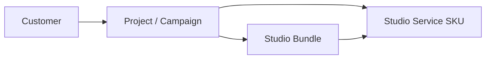
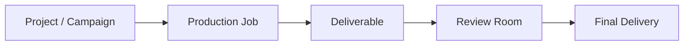

# Studio Service Catalog — Phase 2 (architecture)

**Status:** Implemented locally — not committed unless founder approves.  
**Scope:** Catalog-only unification. No consumer wiring (Route Map UI overrides, Checkout, Studio Board, Review Room, Final Delivery).

## Schema

- **`StudioServiceEntry` schema v3** — `CATALOG_SCHEMA_VERSION = 3`
- **V2-ready optional fields** (populated at export via `normalizeStudioServiceEntry` even when seeds omit them):
  - `reviewType` — Review Room sign-off model
  - `deliveryPackage` — Final Delivery package shape
  - `pricingDisplayType` — customer-facing price label strategy (replaces `ROUTE_MAP_PRICE_DISPLAY` local overrides when wired)
  - `qaChecklist` — production QA template + item IDs (aligns with `campaignTasksConfig.qaChecklistLabels`)
  - `aiPromptRef` — stable AI prompt template key (prompt bodies live outside catalog)

Architecture first. Feature richness second — fields exist in schema; Phase 3+ wires consumers.

## Folder structure

```
src/catalog/
  types.ts              — schema v3 types
  normalize.ts          — v3 default derivation at export
  seeds/
    index.ts            — SERVICE_CATALOG assembly + validate
  services.ts           — raw seed data (RAW_SERVICE_CATALOG)
  intake/
    schemas.ts          — Route Map intake forms (absorbed from route-map-intake-v1)
    index.ts
  activation/
    map.ts              — V2 activation map (absorbed from v2/activation-map-draft)
    index.ts
  route-map-launch.ts   — V1 rm-j* seeds
  route-map-v2-launch.ts — V2 RTU seeds
  v2/                   — draft batches (unchanged behavior)
```

**Compatibility re-exports (no consumer path changes):**

- `src/config/route-map-intake-v1.ts` → `@/catalog/intake`
- `src/catalog/v2/activation-map-draft.ts` → `@/catalog/activation`

## Business relationships

How catalog entities relate across the customer journey and production stack.

### Customer → Projects → Services → Bundles



- **Customer** enters via Studio Lobby, Studio Guide, or Route Map.
- **Project** (Campaign Record) holds the approved plan — selected service IDs, intake answers, payment state.
- **Service** is the atomic catalog SKU (`StudioServiceEntry`) — price, scope, deliverables, timing, governance.
- **Bundle** (Spark / Momentum / Growth) is a fixed composition of catalog service IDs — not customizable; personalized plans use individual services.

The catalog is the single source of truth for service definitions. Bundles reference catalog IDs; they do not duplicate scope or pricing rules.

### Projects → Production Jobs → Deliverables → Final Delivery



- **Production Job** maps to a purchased catalog SKU (or Route Map shelf job) on the Studio Board / File Room task plan.
- **Deliverable** instances come from catalog `deliverables` + `deliveryMapping.items` — quantity and unit keys for campaign tracking.
- **Review Room** reads `reviewType` (v3) per service when wired — standard production review vs RTU handoff vs strategy direction.
- **Final Delivery** reads `deliveryPackage` (v3) — project files, monthly batch, ready-to-use files, execution handoff, or advisory.

### Catalog field routing (V2-ready, not wired)

| Field | Future consumer |
|-------|-----------------|
| `reviewType` | Review Room, Studio Board materials workflow |
| `deliveryPackage` | Final Delivery, deliverables room |
| `pricingDisplayType` | Route Map shelf, Project Summary, Secure Checkout |
| `qaChecklist` | File Room QA panel, production task plan |
| `aiPromptRef` | Internal production AI assist (prompt registry TBD) |

## Phase 2 conflicts preserved (not resolved)

| Layer | Location | Phase 3 action |
|-------|----------|----------------|
| Route Map timing labels | `route-map-v1.ts` `ROUTE_MAP_JOB_TIMING` | Migrate to catalog `firstReviewWindow` / dedicated turnaround field |
| Route Map price display | `route-map-v1.ts` `ROUTE_MAP_PRICE_DISPLAY` | Migrate to catalog `pricingDisplayType` |
| Materials heuristics | `src/lib/materials/requirements.ts` | Read catalog requirements |
| Bundle mock | `src/project-summary/types.ts` | Read catalog bundle compositions |
| V2 draft catalog | `src/catalog/v2/*` | Merge into v3 seeds when Batch 3 activates |

## No wiring confirmation

Phase 2 does **not** change:

- Route Map UI behavior
- Secure Checkout / payment flows
- Studio Board tiles or activity feed
- Recommendation Engine scoring
- Discovery mapping
- Production task generation
- Review Room or Final Delivery pages

All existing tests for green services, catalog validation, and accessors should pass unchanged.
