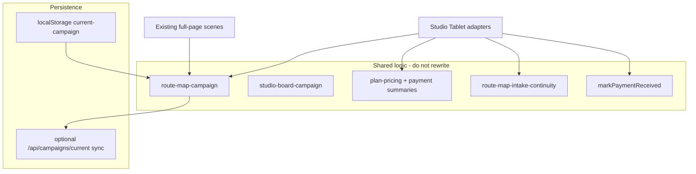

# Studio Tablet Architecture Plan

**Status:** Locked for T1 Shell package (architecture + physical/safe-area specification).  
**Direction addendum (2026-07-18):** [`studio-tablet-v1-direction.md`](studio-tablet-v1-direction.md) — tablet as heart of The Studio; invisible employee operates it; React screens only (no PNG UI).  
**Date:** 2026-07-17 (plan) · direction updated 2026-07-18  
**Scope:** Architecture and interaction plan; T1 shell code may follow Tagia approval of direction.  
**Authority:** Host Journey certified and locked; Tablet is a new Host operating shell around that journey.

---

## 1. Purpose

Create the implementation plan for a real, usable **Studio Tablet** that holds the locked Host Journey so the Studio Guide can operate the full path while speaking with the customer, and so the customer can see a simplified mirrored projection of what she is doing.

The Tablet must feel like a real object in The Studio (functional environmental component), not a shrunk browser page in a decorative frame.

## 2. Guardrails

| May | Must not |
|-----|----------|
| Plan shell, panels, projection boundary, files | Redesign locked journey systems |
| Reuse campaign, pricing, intake, payment logic | Rewrite business rules |
| Panelize presentation for tablet usability | Embed full-page scenes in an iframe “coffin” |
| Defer Guide artwork until dimensions proven | Host character design / animation in this plan |
| Split work into T1–T4 | Commit / push / unrelated cleanup |

**Locked journey (unchanged):**

1. Route Map  
2. Project Builder  
3. Studio Plan  
4. Review and Confirm  
5. Project Intake  
6. Studio Board handoff (auth preserved)

## 3. Approved architecture decisions

| Decision | Choice |
|----------|--------|
| Host route | `/studio-tablet` |
| Shell | One reusable `StudioTabletShell` |
| Orientation | Portrait-primary |
| Preferred logical viewport | **834 × 1112 CSS px** |
| Navigation | Stage-based inside the Tablet (`?stage=`) |
| Logic | Existing campaign / pricing / intake / payment reused |
| Surfaces | Host controls + read-only customer projection |
| Presentation | Adapters + focused panels (not full-page embed) |
| Board | Authentication preserved — no bypass |
| Guide | Deferred until Tablet dimensions are proven |
| Packages | T1 Shell → T2 Commerce panels → T3 Route + Intake → T4 Board handoff + cert |

---

## 4. Current component map

| Stage | Route today | Orchestrator | Key children | Config |
|-------|-------------|--------------|--------------|--------|
| Route Map | `/route-map` | `src/components/route-map/RouteMapScene.tsx` | Workspace, ChoosePanel, JobCard, IntakeForm | `src/config/route-map-v1.ts` |
| Builder | `/project-builder?road=` | `src/components/project-builder/ProjectBuilderScene.tsx` | Tiles, Drawer, SummaryRail, SquishyCompanion | `src/config/project-builder-v1.ts` |
| Studio Plan | same + `view=studio-plan` | same Scene | `ProjectBuilderStudioPlanSummary.tsx` | same |
| Review and Confirm | `/checkout` | `src/components/checkout/CheckoutScene.tsx` | `SecureCheckoutGrid.tsx` | `src/config/payment.ts` |
| Intake | `/route-map?step=intake` | RouteMapScene branch | IntakeForm, continuity gates | `src/lib/route-map-intake-continuity.ts` |
| Board | `/studio-board` | `src/components/studio-board/StudioBoardScene.tsx` | next-action, progress, auth panel | `src/config/studio-board.ts` |

**CSS / layout risk (why not embed full pages):** Route Map immersive `100dvh` world; dual-column builder collapse; intake sheet heights; Board `overflow: hidden`; competing breakpoints at 900 / 960 / 1024 CSS px.

Full-page routes remain live for bookmarks and quarantine. The Tablet is the Host operating surface.

## 5. State and dependency map



| Concern | Source of truth |
|---------|-----------------|
| Campaign / selections / journey step | `studio-squishy:current-campaign` via `studio-board-campaign.ts` / `route-map-campaign.ts` |
| Pricing | `plan-pricing.ts`, `buildRouteMapPaymentSummaryFromServices`, studio-plan summary builder |
| Paid → intake | `markPaymentReceived()` then continuity gates |
| Sync | Best-effort; Host UI must not alarm on unavailable remote sync |
| Auth | Studio Board only — signed-in Host required |
| Dev chrome | `OwnerQaRoot` — production build only for projection |

---

## 6. Proposed Tablet component tree

```
StudioTabletPage (/studio-tablet)
└── StudioTabletShell
    ├── StudioTabletFrame          // bezel, glass, dock chrome
    ├── StudioTabletScreen         // logical 834×1112 (or scaled) opening
    │   ├── StudioTabletChrome     // progress, Back, Confirm/Continue, save/loading
    │   ├── StudioTabletHostSurface
    │   │   └── stage adapters (empty in T1; wired in T2–T4)
    │   └── StudioTabletProjectionSurface  // read-only mirror region
    └── StudioTabletScale          // fit logical viewport into available opening
```

**Stage ids (`?stage=`):**  
`route-map` | `builder` | `studio-plan` | `review-confirm` | `intake` | `board-handoff`

**Surface mode (`?surface=`):**  
`host` | `both` | `projection` (Phase 1 same device; second display can reuse projection later)

**Config (future):** `src/config/studio-tablet-v1.ts` — viewport constants, insets, type/touch floors, stage labels, projection allowlist.

---

## 7. Host-view and projection-view boundaries

### Host view (Guide)

- Full controls and internal navigation  
- Service details and explanations  
- Editable answers and form fields  
- Price calculations and validation  
- Status / loading (non-alarming)  
- Knowledge support (help copy already in journey configs)  
- Customer confirmation state  
- Back, Confirm, Continue  

### Customer projection view

**May show:** current topic, selected route, services added, answers captured (customer-facing), pricing / Estimated Investment, summaries, confirmation prompts.

**Must never show:** developer tools, Owner QA / Studio Review, private notes, authentication details, internal warnings, sync failure chrome, sandbox badges, hidden controls, unnecessary form mechanics (card field chrome when honesty mode can summarize), raw validation stack traces.

---

## 8. Interaction model

**Rhythm:** Ask → Listen → Enter → Show → Pause → Confirm → Continue

| Stage | Stopping point | Projection updates | Panel advances |
|-------|----------------|--------------------|----------------|
| Route Map | Customer picks lane | On road select | After confirm → Builder |
| Builder | After adds | On each add/remove | Host Continue → Studio Plan |
| Studio Plan | Before money path | Plan + total | Confirm → Review and Confirm |
| Review and Confirm | Before paid-state stamp | Honesty + total | Confirm → Intake |
| Intake | Per form group | As answers saved | Next group / Submit → Board handoff |
| Board handoff | Sign-in if needed | “On the Board” only | Open Board / end |

**Corrections:** Back returns to prior `stage`; selections persist unless Host edits.  
**Progress:** Same campaign record + journey step fields as full pages.

---

## 9. Form presentation strategy

Do **not** shrink full pages into the frame.

Use **stage adapters** that mount **focused panels**, reusing logic and copy:

| Stage | Host panels | Reuse |
|-------|-------------|-------|
| Route Map | Road list + How-it-works teaser (not full highway world) | `route-map-v1` roads; persistence via `route-map-campaign` |
| Builder | Service list → detail → add/remove | Project Builder config + campaign mutations |
| Studio Plan | Summary cards | `project-builder-studio-plan-summary` |
| Review and Confirm | Plan → contact → honesty → Confirm | `payment.ts` + checkout grid data path |
| Intake | One schema section per panel | Intake schemas + continuity gates |
| Board handoff | Status + sign-in reminder + Open Board | Auth gate unchanged |

Preserve: copy, questions, pricing, route logic, validation, summaries.  
Change: presentation chrome and panelization only.

---

## 10. Tablet Physical and Safe-Area Specification

This section is the engineering opening for the shell. Decorative frame art must respect these exclusions; it may not invent a smaller usable screen.

### 10.1 Preferred logical viewport

| Property | Value |
|----------|-------|
| Orientation | Portrait-primary |
| Logical screen opening | **834 × 1112 CSS px** |
| Aspect | ≈ 3:4 (iPad-class content area) |
| Scaling | Uniform scale-to-fit into the available physical opening; never non-uniform stretch |

Landscape: same panel stack; shell may letterbox or widen Host lists — must not drop below type/touch floors in §10.3–10.4.

### 10.2 Minimum supported usable viewport

The smallest **logical** viewport at which every Tablet stage must remain **comfortably** readable and operable (not merely “still renders”):

| Dimension | Minimum |
|-----------|---------|
| Width | **768 CSS px** |
| Height (keyboard closed) | **960 CSS px** |
| Height (keyboard open — worst case) | **520 CSS px** remaining above keyboard for scrollable panel + pinned chrome (see §10.5) |

At minimum width/height the product must still support:

- Comfortable reading (floors in §10.3)  
- Touch interaction (floors in §10.4)  
- Form completion  
- Visible primary action (Confirm / Continue)  
- No clipped controls  
- No horizontal scrolling  

If a device/browser cannot meet these floors after scale-to-fit, the Host tool must show a non-destructive “widen or rotate” notice rather than operate below floors.

### 10.3 Safe content area (insets inside the logical screen)

Insets are measured **inward from the logical 834×1112 screen opening**, before stage content. They reserve chrome and exclude frame/dock overlap.

| Edge | Inset | Purpose |
|------|-------|---------|
| **Top** | **56 px** | Progress indicator + stage title band |
| **Bottom** | **72 px** | Primary Confirm / Continue (and secondary Back when co-located) |
| **Left** | **24 px** | Content gutter + bezel/hand clearance |
| **Right** | **24 px** | Content gutter + bezel/hand clearance |

**Derived Host content box (preferred viewport, keyboard closed):**

- Width: `834 − 24 − 24 = 786 px`  
- Height: `1112 − 56 − 72 = 984 px`  

**Additional fixed Host chrome (within the screen, not in projection):**

- Back control lives in the **top** band (left) or as a secondary control in the **bottom** band — never floating over projection pixels.  
- Save/loading status, if shown, sits in the top band and must remain non-alarming (no “Save failed” on Host/projection surfaces).

Frame, glass edge, dock shadow, and reflection sit **outside** the logical screen opening (see §10.8). They do not consume the 834×1112 opening except via the deliberate insets above.

### 10.4 Typography limits

No stage may scale text beneath these floors (CSS `px` at logical viewport scale 1.0):

| Role | Minimum size |
|------|----------------|
| Body text | **16 px** |
| Helper / secondary text | **14 px** |
| Field labels | **14 px** |
| Button text (primary and secondary) | **16 px** |
| Stage title (chrome) | **20 px** |
| Progress / eyebrow | **12 px** (only for short uppercase chrome labels) |

Customer instructional copy remains complete sentences (journey lock) — do not truncate with ellipses to fit.

### 10.5 Touch limits

| Control | Minimum |
|---------|---------|
| Text field height | **48 px** |
| Button height (primary / secondary) | **48 px** |
| Tap-target size (icon-only or chip) | **44 × 44 px** |
| Spacing between adjacent interactive controls | **8 px** gap minimum; **12 px** preferred |
| List row (road / service) height | **56 px** minimum |

### 10.6 Keyboard state

Applies when the software keyboard is open on Review and Confirm or Intake (worst case).

| Rule | Specification |
|------|----------------|
| Remaining viewport height | Host must keep **≥ 520 CSS px** usable above the keyboard for (scrollable panel + visible pinned primary action). If the OS keyboard is taller, the shell scrolls the **active panel only** and keeps chrome rules below. |
| Active panel | **Scrolls** inside the screen content box |
| Primary action | **Stays pinned** to the bottom chrome band (above the keyboard / `visualViewport` bottom) |
| Focused fields | On focus, scroll the active panel so the field sits in the upper half of the remaining content box (above keyboard), with ≥ 16 px padding below the top chrome |
| Back | Remains reachable (top band or bottom secondary) |
| Customer projection | **Does not change layout mode during typing.** Projection may update field values as committed/blurred answers; it must not show caret, partial keystrokes, or Host keyboard chrome. Prefer commit-on-blur / Continue for projection updates on free-text fields |

### 10.7 Scroll boundary

| Region | Behavior |
|--------|----------|
| Browser page outside shell | **Never scrolls** for Tablet operation. `html`/`body` (or shell host) locks overflow; only the Tablet screen content scrolls |
| Physical shell / frame / dock | Fixed in the page composition (or fixed in Lobby scene later) — no document overflow “hanging” below the tablet |
| Inside screen — chrome (top/bottom bands) | **Fixed** within the logical screen |
| Inside screen — Host panel body | **Scrolls vertically** as needed |
| Horizontal scroll | **Forbidden** at all stages |
| Maximum recommended single-panel body height before split | Prefer panels whose unscrolled content fits in the content box (~**984 px** preferred; ~**720 px** target for dense forms). If a form group exceeds **~640 px** of fields/copy at minimum type sizes, it **must** become a new panel |
| When a form group becomes a new panel | Natural schema section boundary; contact vs card vs acknowledgment on Review and Confirm; each intake schema section / materials block on Intake |

### 10.8 Projection-safe region

On `surface=both`, the projection-safe region is a dedicated band or pane that receives **only** the allowlisted mirror model.

| Mode | Projection region |
|------|-------------------|
| `host` | No projection chrome required |
| `both` | Reserved strip or secondary pane — recommended **≥ 280 px** tall (portrait stack) or **≥ 320 px** wide (side mirror), outside Host chrome controls |
| `projection` | Full logical screen is projection-safe content only (no Host chrome) |

**Projection deny-list (hard):** Host Back/Confirm chrome, system sync status, private notes, authentication UI, internal validation dumps, OwnerQa / Studio Review, sandbox/test badges, API errors, URL query debug params.

### 10.9 Shell allowance (engineering opening)

The frame may **not** cover any logical screen pixels unless those pixels sit inside a deliberate safe inset already counted in §10.3.

| Allowance | Value |
|-----------|--------|
| Required visible screen opening | **834 × 1112 CSS px** (preferred); never smaller than **768 × 960** after scale accounting for closed-keyboard operable height |
| Bezel exclusion zone | Frame/bezel drawn **outside** the opening — minimum **16 px** visual bezel beyond the opening on each side (decorative; not subtractive from 834×1112) |
| Corner-radius exclusion | Screen content must keep **≥ 12 px** distance from the inner corner curve (satisfied by the 24 px L/R and chrome bands; do not place tap targets in the outer 12 px of the opening corners) |
| Dock overlap exclusion | Dock, stand, and reflection **must not** overlap the logical opening. Dock occupies space **below** the frame only |
| Hand-clearance area | **≥ 48 px** clear space below the physical frame for Host grip when docked/held — outside the logical opening |
| May the frame cover screen pixels? | **No** — unless the covered pixels are already inside the published safe insets (top 56 / bottom 72 / left 24 / right 24). No additional undocumented overlap |

### 10.10 Worst-case screen (dimension ruler)

**Ruler state for validating Tablet dimensions:**

> **Review and Confirm — contact fields + card placeholder fields + acknowledgment + pinned “Confirm and continue to Project Intake”, with the software keyboard open on a text field.**

Why this ruler (not Intake alone):

- Dense stacked fields (contact + card)  
- Long honesty copy above the fold competition  
- Primary CTA must remain visible  
- Keyboard open is the true height stress  

**Secondary validation state (must also pass):**

> **Intake — longest single schema section (e.g. Social Posts specialized UI) with keyboard open and pinned Continue.**

T1 Shell empty adapters must still demonstrate chrome + scroll + keyboard pinning against a **fixture form** that matches the ruler’s field density before T2 moves real journey forms in.

### 10.11 Summary constants (for `studio-tablet-v1.ts` later)

```
VIEWPORT_PREFERRED = 834 × 1112
VIEWPORT_MIN = 768 × 960
INSET_TOP = 56
INSET_BOTTOM = 72
INSET_X = 24
CONTENT_PREFERRED = 786 × 984
TYPE_BODY_MIN = 16
TYPE_HELPER_MIN = 14
TYPE_LABEL_MIN = 14
TYPE_BUTTON_MIN = 16
TOUCH_FIELD_MIN_H = 48
TOUCH_BUTTON_MIN_H = 48
TOUCH_TARGET_MIN = 44
TOUCH_GAP_MIN = 8
KEYBOARD_REMAINING_MIN_H = 520
PANEL_SPLIT_AFTER_H ≈ 640
PROJECTION_STRIP_MIN_H = 280
BEZEL_OUTSIDE_MIN = 16
CORNER_CLEAR_MIN = 12
HAND_CLEAR_BELOW_FRAME = 48
FRAME_COVERS_SCREEN_PIXELS = false (except published insets)
RULER = review-confirm + keyboard open
```

---

## 11. Visual integration (plan only)

- Portrait dock/hold primary; frame + glass analogous to Weather Portal (functional object)  
- Customer viewing angle: projection readable at conversation distance  
- Host face: larger tap targets per §10.5  
- Lobby: Tablet is a Studio object the Guide will later stand beside  
- **Do not design or generate the Guide in this package**

---

## 12. Stage-by-stage integration plan

1. **T1 — Shell** — frame, glass, dock, chrome, scale, Host/projection boundaries, **empty** stage adapters, fixture ruler for keyboard/chrome  
2. **T2 — Commerce panels** — Builder → Studio Plan → Review and Confirm (real logic)  
3. **T3 — Route + Intake panels** — road select + intake gates/sections  
4. **T4 — Board handoff + cert** — auth-preserving handoff, e2e, projection deny-list, runbook update  

Full-page journey routes stay available; Tablet does not quarantine them.

## 13. Exact files likely created or changed

### This documentation lock (now)

| File | Action |
|------|--------|
| `docs/studio-tablet-architecture-plan.md` | **Created (this document)** |

### Later — T1 Shell (not this step)

| File | Action |
|------|--------|
| `src/app/studio-tablet/page.tsx` | Create |
| `src/app/studio-tablet/studio-tablet.css` | Create |
| `src/components/studio-tablet/StudioTabletShell.tsx` | Create |
| `src/components/studio-tablet/StudioTabletFrame.tsx` | Create |
| `src/components/studio-tablet/StudioTabletChrome.tsx` | Create |
| `src/components/studio-tablet/StudioTabletHostSurface.tsx` | Create |
| `src/components/studio-tablet/StudioTabletProjectionSurface.tsx` | Create |
| `src/components/studio-tablet/adapters/*Empty*.tsx` | Create stubs |
| `src/config/studio-tablet-v1.ts` | Create (constants from §10.11) |
| `src/lib/studio-tablet-*.test.ts` | Create |

### Later — T2–T4 (minimal)

| Area | Change |
|------|--------|
| Checkout grid | Optional `layout="tablet"` or extracted sections — no honesty-copy rewrite |
| Journey docs / runbook | Note `/studio-tablet` as Host tool |
| AGENTS customer-journey table | Add Tablet Host route when T1 ships |

### Do not change

Route Map visual locks, Lobby locks, Host character standard, Recommendation Engine, catalog business rules, Review and Confirm honesty doctrine.

## 14. Testing strategy

| Layer | What |
|-------|------|
| Unit | Stage router, inset/math helpers, projection allowlist/deny-list |
| Component | Chrome Back / Confirm pin; keyboard remaining height; no document overflow |
| Visual ruler | Review and Confirm fixture + keyboard open at 834×1112 and at 768×960 |
| E2E (T4) | Tablet stage chain through Intake; Board still auth-gated |
| Projection hygiene | Production build — no Studio Review / OwnerQa |

## 15. Risks and blockers

| Risk | Mitigation |
|------|------------|
| Embedding full RouteMapScene | Panel adapter only (T3) |
| Host uses Tablet + full pages simultaneously | Same localStorage; runbook: one operating surface |
| Board auth mid-demo | Handoff panel + sign in before projection |
| Soft keyboard covers CTA | Pinned bottom chrome + §10.6 |
| Scope into Guide animation | Deferred until shell proven |
| Frame art eats pixels | §10.9 — frame outside opening |

**Still blocked for character work:** Guide placement/animation waits on T1 proving these dimensions.

## 16. Recommended implementation packages

| Package | Delivers |
|---------|----------|
| **T0 — Docs lock** | This file — **done when Tagia locks** |
| **T1 — Studio Tablet Shell** | Physical shell, glass, frame, dock, stage chrome, scaling, Host/projection boundaries, **empty** adapters + ruler fixture. **No journey forms moved yet.** |
| **T2 — Commerce panels** | Builder, Studio Plan, Review and Confirm adapters |
| **T3 — Route + Intake** | Route Map + Intake panel adapters |
| **T4 — Board handoff + cert** | Handoff, e2e, deny-list, runbook |

## 17. Code authorization

**T1 Shell** is authorized to land as React components under `src/components/studio-tablet/` and `/studio-tablet`, following §10 measurements and [`studio-tablet-v1-direction.md`](studio-tablet-v1-direction.md).

Journey furniture (real forms) waits for T2+. Guide / invisible-employee wardrobe is separate from the tablet shell.

---

## 18. Document lock statement

Architecture direction and Tablet Physical and Safe-Area Specification are approved for implementation planning.  

**Journey systems remain locked.**  
**Guide artwork remains deferred.**  
**T1 builds the shell and empty rooms to these measurements before any journey furniture moves in.**
